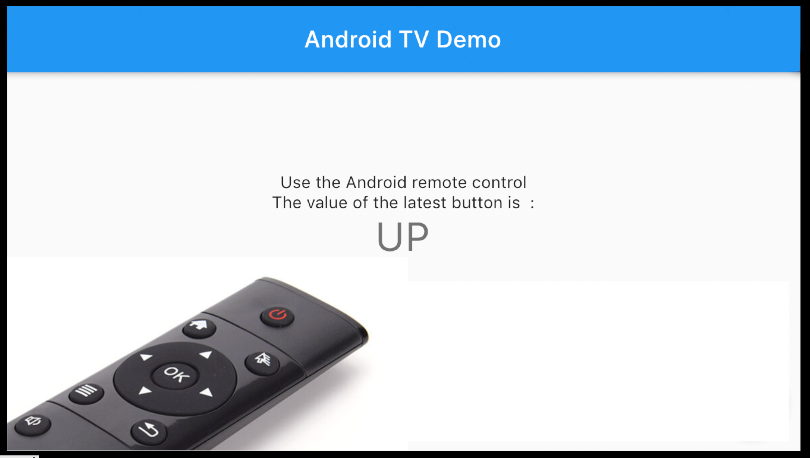

# Android TV (with *d'pad*) Demo

A demonstration of a Flutter Android TV app , showing how the "d-pad" (Android remote) can be accessed.



### To run

```
flutter run
```

## How to deploy to Android TV


#### First Build the App Locally and Make It Available for Download

1. Build an app that has the “d-pad” support (here is one I prepared earlier: https://github.com/cocreations/android_tv_dpad_basic)
2. Use [`serve`](https://www.npmjs.com/package/serve) in the folder with the .apk so it’s available via port 80
3. Use [`ngrok`](https://ngrok.com/) to get the location available on the internet

```
flutter build apk  
cd build/app/outputs/flutter-apk/
serve
ngrok http 5000   # this in another tab
```

#### Next Install the App on your Android TV

1. Go into **Apps**, open the **Google Play Store**, and
2. Install an app that will allow browsing to a URL
(I found and recommend [**Downloader by AFTVnews**](https://play.google.com/store/apps/details?id=com.esaba.downloader))
3. Go home, open **Settings (cog icon) > Apps > Security & restrictions**
4. Untick *Verify apps*, choose *Unknown sources*, and allow the new **Downloader by AFTVnews** app to do this
5. Go home, and run the **Downloader by AFTVnews** app,
and type in the ngrok URL
(eg. https://b3cdd4f102eb.ngrok.io/app-release.apk)
6. Install and Open the app !


-----

## Want custom Androd TV or Mobile apps developed ?

CoCreations is a software house that works closely with you to develop unique and beautiful mobile apps and systems.

[](https://cocreations.com.au/)
